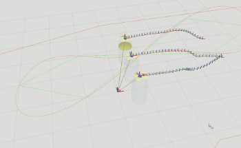

# DOP SIM

DOP SIM is a simulator using DOP (Data-oriented Programming) paradigm, supporting downwash effect of quadrotors!

This simulator only contains dynamics and body rate controller, and it leverages mavros_msgs as communication protocol, aiming to be compatible with MAVROS. If you want to achieve the effect in that gif, including trajectory generation and control, please visit my other repositories [link].

[TOC]

## Installation

1. install ROS noetic following http://wiki.ros.org/noetic/Installation/Ubuntu
2. install PyTorch with GPU option following https://pytorch.org/get-started/locally/

3. Create a workspace for ROS noetic, then go to the /src
4. `sudo apt install ros-noetic-mavros_msgs`
5. `git clone https://github.com/Li-Jinjie/dop_sim.git`
6. `catkin build` to build the whole workspace. Done!

## Getting Started

Before each running:  `cd /path_to_workspace` and then `source devel/setup.bash`

- If you want to make one quadrotor fly, just run `roslaunch mul_qd_w_rviz.launch config_file:=one_qd_config.yaml`
- If you want to make three quadrotor fly, just run `roslaunch mul_qd_w_rviz.launch config_file:=three_qd_config.yaml`
- If you want to make multiple quadrotors fly, just run `roslaunch mul_qd_w_rviz.launch config_file:=mul_qd_config.yaml`, and please change mul_qd_config.yaml as you wish.

## How to measure model time (optional)

1. install LibTorch in C++
2. install pytorch in python
3. ROS is not a must, but it is recommended
4. run 'scripts/measure_model_time.py' to measure the time of python code and save to a model.
5. use CMakeLists.txt.w_cpp as CMakeLists.txt, then run 'src/measure_model_time.cpp' to measure the time of C++ code.

## License

GPLv3. Please also open-source your project if you use the code from this repository. Let's make the whole community better!
